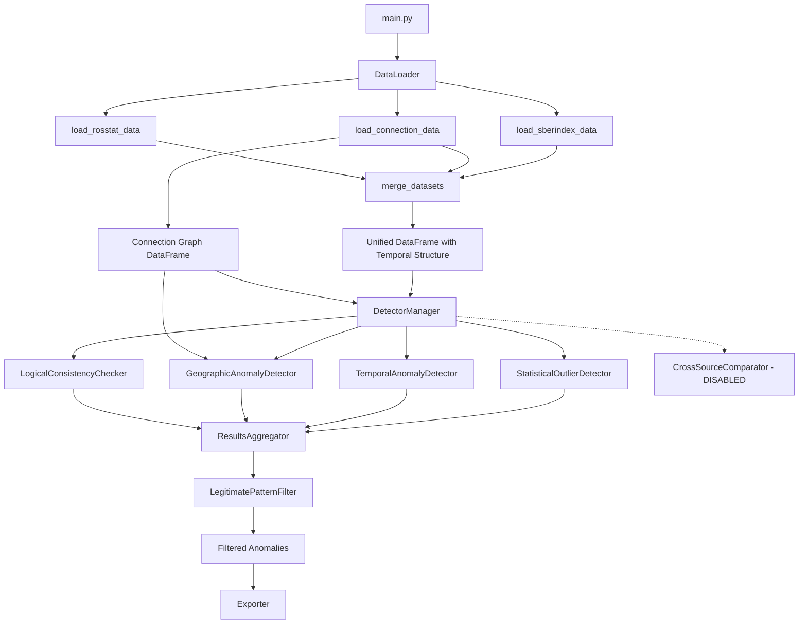

# Design Document

## Overview

This design addresses critical bugs identified in the СберИндекс Anomaly Detection System audit. The system currently produces 73-95% false positives due to fundamental data processing errors, invalid cross-source comparisons, and inappropriate statistical thresholds for Russia's geographic heterogeneity. This design provides a systematic approach to fix these issues while maintaining backward compatibility and system stability.

### Design Goals

1. **Preserve Temporal Structure**: Maintain date columns in consumption data to enable temporal analysis
2. **Utilize Connection Graph**: Leverage 4.7M territory connections for accurate geographic neighbor analysis
3. **Eliminate Invalid Comparisons**: Disable cross-source detector that compares incompatible metrics
4. **Apply Russia-Specific Thresholds**: Calibrate statistical thresholds for extreme geographic variation
5. **Handle Skewed Distributions**: Apply log transforms to power-law distributed metrics
6. **Filter Legitimate Patterns**: Identify and exclude expected variations (tourism, business districts, remote areas)
7. **Maintain Backward Compatibility**: Gracefully handle missing data files and legacy configurations

## Architecture

### Component Interaction Diagram



### Data Flow

1. **Data Loading Phase**
   - Load consumption.parquet with temporal structure preserved
   - Load connection.parquet for geographic analysis
   - Load Росстат data for enrichment
   - Merge datasets maintaining temporal dimensions

2. **Detection Phase**
   - Apply Russia-specific thresholds from custom profile
   - Run enabled detectors (statistical, temporal, geographic, logical)
   - Skip disabled detectors (cross-source)
   - Pass connection graph to geographic detector

3. **Filtering Phase**
   - Apply legitimate pattern filter
   - Remove or flag known legitimate variations
   - Aggregate and prioritize remaining anomalies

4. **Export Phase**
   - Generate reports and visualizations
   - Export filtered anomaly list

## Components and Interfaces

### 1. DataLoader Enhancements

#### 1.1 Temporal Structure Preservation

**Current Implementation (BROKEN):**
```python
consumption_pivot = consumption_df.pivot_table(
    index='territory_id',
    columns='category',
    values='value',
    aggfunc='mean'  # ❌ Destroys temporal structure
)
# Result: 303,126 rows → 2,571 rows (99% data loss)
```

**Fixed Implementation:**
```python
# Check if temporal data exists
has_date = 'date' in consumption_df.columns

if has_date:
    # Preserve ALL periods for temporal analysis
    consumption_pivot = consumption_df.pivot(
        index=['territory_id', 'date'],  # ✅ PRESERVE DATE
        columns='category',
        values='value'
    ).reset_index()
    
    # Rename columns with prefix
    consumption_pivot.columns = ['territory_id', 'date'] + [
        f'consumption_{col}' for col in consumption_pivot.columns[2:]
    ]
else:
    # No temporal data - use simple pivot
    consumption_pivot = consumption_df.pivot_table(
        index='territory_id',
        columns='category',
        values='value',
        aggfunc='mean'
    ).reset_index()
```

**Interface Changes:**
- `merge_datasets()` now returns DataFrame with optional 'date' column
- Downstream detectors must handle temporal structure with `groupby('territory_id')`

#### 1.2 Connection Graph Loading

**New Method:**
```python
def load_connection_data(self) -> pd.DataFrame:
    """
    Load connection graph data (4.7M connections).
    
    Returns:
        DataFrame with columns:
        - territory_id_x: Source territory
        - territory_id_y: Target territory
        - distance: Distance in km
        - type: Connection type
        
        Returns empty DataFrame if file not found.
    """
```

**Validation:**
- Check for required columns: territory_id_x, territory_id_y, distance
- Log statistics: unique territories, connection types
- Return empty DataFrame on error (graceful degradation)

### 2. GeographicAnomalyDetector Enhancements

#### 2.1 Connection Graph Integration

**New Method:**
```python
def _get_neighbors(
    self, 
    territory_id: int, 
    connections: pd.DataFrame, 
    max_distance: float = 50.0
) -> List[int]:
    """
    Get neighboring territories from real connection graph.
    
    Args:
        territory_id: Territory to find neighbors for
        connections: Connection graph DataFrame
        max_distance: Max distance in km (default 50km)
    
    Returns:
        List of neighbor territory IDs
    """
```

**Algorithm:**
1. Query connections where territory_id appears in either territory_id_x or territory_id_y
2. Filter by distance <= max_distance
3. Extract neighbor IDs from opposite column
4. Deduplicate and return list

**Modified Method:**
```python
def detect_cluster_outliers(
    self, 
    df: pd.DataFrame,
    connections: pd.DataFrame = None  # ✅ NEW PARAMETER
) -> List[Dict[str, Any]]:
    """
    Detect territories that differ from their real neighbors.
    Uses connection graph instead of administrative regions.
    """
```

**Logic:**
1. If temporal data exists, use latest period for geographic analysis
2. If connections provided and not empty, use graph-based neighbor detection
3. If connections missing, fall back to region-based clustering with warning
4. Require minimum 3 neighbors for comparison
5. Compare territory vs neighbors for each indicator

### 3. StatisticalOutlierDetector Enhancements

#### 3.1 Skewness Detection and Log Transform

**New Logic in detect_zscore_outliers():**
```python
for indicator in indicator_cols:
    values = df[indicator].dropna()
    
    # Check skewness
    skewness = values.skew()
    
    if abs(skewness) > 2.0:
        # Highly skewed - apply log transform
        logger.debug(f"Applying log-transform to '{indicator}' (skewness={skewness:.2f})")
        values_transformed = np.log1p(values.clip(lower=0))
        mean_val = values_transformed.mean()
        std_val = values_transformed.std()
        z_scores = (values_transformed - mean_val) / std_val
    else:
        # Normal distribution - use original values
        mean_val = values.mean()
        std_val = values.std()
        z_scores = (values - mean_val) / std_val
```

**Rationale:**
- Power-law distributions (population, consumption) have extreme skewness
- Z-scores on raw values flag natural variation as anomalies
- Log transform normalizes distribution for proper statistical analysis

#### 3.2 Temporal Data Handling

**New Logic:**
```python
def detect_zscore_outliers(self, df: pd.DataFrame, threshold: Optional[float] = None):
    # Handle temporal data
    if 'date' in df.columns:
        # Analyze latest period for statistical outliers
        df_latest = df.sort_values('date').groupby('territory_id').last().reset_index()
    else:
        df_latest = df
    
    # Continue with outlier detection on df_latest
```

### 4. DetectorManager Enhancements

#### 4.1 Conditional Detector Loading

**Modified _initialize_detectors():**
```python
def _initialize_detectors(self) -> Dict[str, Any]:
    detectors = {}
    detector_config = self.config.get('detectors', {})
    
    # Statistical - enabled by default
    if detector_config.get('statistical', {}).get('enabled', True):
        detectors['statistical'] = StatisticalOutlierDetector(self.config)
    
    # Temporal - enabled by default
    if detector_config.get('temporal', {}).get('enabled', True):
        detectors['temporal'] = TemporalAnomalyDetector(self.config)
    
    # Geographic - enabled by default
    if detector_config.get('geographic', {}).get('enabled', True):
        detectors['geographic'] = GeographicAnomalyDetector(self.config)
    
    # CrossSource - DISABLED by default (no valid metric pairs)
    if detector_config.get('cross_source', {}).get('enabled', False):
        detectors['cross_source'] = CrossSourceComparator(self.config)
        logger.warning("⚠ CrossSourceComparator enabled - verify metric pairs are valid")
    
    # Logical - enabled by default
    if detector_config.get('logical', {}).get('enabled', True):
        detectors['logical'] = LogicalConsistencyChecker(self.config)
    
    return detectors
```

#### 4.2 Connection Graph Passing

**Modified run_all_detectors():**
```python
def run_all_detectors(self, df: pd.DataFrame, connections: pd.DataFrame = None):
    """
    Run all detectors with error handling.
    
    Args:
        df: DataFrame containing municipal data
        connections: Optional connection graph for geographic analysis
    """
    for detector_name, detector in self.detectors.items():
        anomalies_df = self.run_detector_safe(detector_name, detector, df, connections)
```

**Modified run_detector_safe():**
```python
def run_detector_safe(self, detector_name, detector, df, connections=None):
    try:
        # Pass connections to geographic detector
        if detector_name == 'geographic' and connections is not None:
            anomalies = detector.detect(df, connections=connections)
        else:
            anomalies = detector.detect(df)
```

### 5. Configuration Enhancements

#### 5.1 Russia-Specific Profile

**New Profile in config.yaml:**
```yaml
detection_profile: "custom_russia"

threshold_profiles:
  custom_russia:
    statistical:
      z_score: 5.0              # 3.0 → 5.0 (extreme heterogeneity)
      iqr_multiplier: 3.0       # 1.5 → 3.0
      percentile_lower: 0.1     # 1 → 0.1 (only extreme outliers)
      percentile_upper: 99.9    # 99 → 99.9
      use_robust_stats: true
    
    temporal:
      spike_threshold: 200      # 100 → 200 (rare events)
      drop_threshold: -80       # -50 → -80
      volatility_multiplier: 3.0
    
    geographic:
      regional_z_score: 6.0     # 3.5 → 6.0 (Moscow vs Chukotka)
      cluster_threshold: 5.0    # 4.0 → 5.0
      min_neighbors: 3
    
    cross_source:
      enabled: false            # ✅ DISABLED
    
    logical:
      check_negative_values: true
      check_impossible_ratios: false  # ❌ Too many false positives
```

#### 5.2 Detector Enable/Disable

**New Section in config.yaml:**
```yaml
detectors:
  statistical: 
    enabled: true
  temporal:
    enabled: true
  geographic:
    enabled: true
  cross_source:
    enabled: false  # ❌ No comparable metrics
  logical:
    enabled: true
```

#### 5.3 Auto-Tuning Disable

**Modified Section:**
```yaml
auto_tuning:
  enabled: false  # ✅ DISABLED (no ground truth dataset)
```

### 6. LegitimatePatternFilter Integration

#### 6.1 Filter Application in main.py

**New Code After Aggregation:**
```python
# After: combined_anomalies = aggregator.combine_anomalies(all_anomalies)

if len(combined_anomalies) > 0:
    try:
        from src.legitimate_pattern_filter import LegitimatePatternFilter
        
        logger.info("Applying legitimate pattern filter...")
        pattern_filter = LegitimatePatternFilter(config)
        
        # Filter anomalies
        filtered_df = pattern_filter.filter_anomalies(combined_anomalies)
        
        # Count reclassified
        legitimate_count = (filtered_df['is_legitimate_pattern'] == True).sum()
        logger.info(f"✅ Reclassified {legitimate_count} anomalies as legitimate patterns")
        
        # Remove legitimate patterns
        combined_anomalies = filtered_df[
            filtered_df['is_legitimate_pattern'] == False
        ].copy()
        
        logger.info(f"After filtering: {len(combined_anomalies)} anomalies remain")
        
    except ImportError:
        logger.warning("LegitimatePatternFilter not found - skipping")
    except Exception as e:
        logger.warning(f"Failed to apply pattern filter: {e}")
```

#### 6.2 Legitimate Patterns Configuration

**Existing legitimate_patterns_config.yaml:**
- Tourism zones (Sochi, Crimea, etc.)
- Shift-work territories (oil/gas extraction)
- Industrial centers (manufacturing hubs)
- Border territories (cross-border trade)
- Transport hubs (airports, ports)
- Remote areas (extreme north, Siberia)

**Proposed Additions:**
```yaml
legitimate_patterns:
  # NEW: Business districts
  business_districts:
    reason: "Daytime population exceeds residential"
    territories:
      - "Москва-Сити"
      - "Центральный административный округ"
      - "Красногорск"
      - "Иннополис"
  
  # NEW: University cities
  university_cities:
    reason: "Students create anomalous consumption patterns"
    territories:
      - "Томск"
      - "Новосибирск"
      - "Казань"
      - "Санкт-Петербург"
      - "Обнинск"

# NEW: Auto-whitelist rules
auto_whitelist_rules:
  low_density_threshold: 1.0  # people/km²
  tourism_intensity_threshold: 0.5  # tourists/residents
  border_proximity_km: 50
```

## Data Models

### Unified DataFrame Schema

**With Temporal Structure:**
```
territory_id: int
date: datetime (PRESERVED)
municipal_district_name_short: str
region_name: str
oktmo: int
consumption_<category>: float (multiple columns)
market_access: float
population_total: float
population_female: float
population_male: float
migration_total: float
salary_<industry>: float (multiple columns)
```

**Without Temporal Structure (Legacy):**
```
territory_id: int
municipal_district_name_short: str
region_name: str
oktmo: int
consumption_<category>: float (aggregated)
market_access: float
population_total: float
...
```

### Connection Graph Schema

```
territory_id_x: int (source)
territory_id_y: int (target)
distance: float (km)
type: str (highway, etc.)
```

### Anomaly Record Schema

**Unchanged** - maintains existing structure with addition of:
- `is_legitimate_pattern: bool` (added by filter)
- `legitimate_pattern_category: str` (added by filter)

## Error Handling

### Graceful Degradation Strategy

1. **Missing Connection Graph**
   - Log warning: "Connection file not found"
   - GeographicAnomalyDetector falls back to region-based clustering
   - System continues with reduced accuracy

2. **Missing Temporal Data**
   - Detect absence of 'date' column
   - Use aggregated data for statistical analysis
   - TemporalAnomalyDetector skips execution
   - Log info: "No temporal structure detected"

3. **Missing Legitimate Pattern Config**
   - Log warning: "legitimate_patterns_config.yaml not found"
   - Skip pattern filtering
   - System continues without filtering

4. **Detector Failures**
   - Existing error handler captures exceptions
   - Failed detector logged with error message
   - Other detectors continue execution
   - Statistics track success/failure per detector

### Validation Checks

1. **Connection Graph Validation**
   - Check required columns: territory_id_x, territory_id_y, distance
   - Return empty DataFrame if invalid
   - Log warning with missing columns

2. **Temporal Structure Validation**
   - Check for 'date' column existence
   - Verify date column is datetime type
   - Log temporal metadata (granularity, date range)

3. **Threshold Profile Validation**
   - Existing ThresholdManager validates completeness
   - Merge with defaults for missing parameters
   - Log warnings for incomplete profiles

## Testing Strategy

### Unit Tests

1. **test_data_loader_temporal.py**
   - Test consumption data preserves date column
   - Test temporal metadata extraction
   - Test connection graph loading
   - Test graceful handling of missing files

2. **test_geographic_detector_connections.py**
   - Test _get_neighbors() with connection graph
   - Test fallback to region-based clustering
   - Test minimum neighbor requirement
   - Test distance filtering

3. **test_statistical_detector_skewness.py**
   - Test skewness detection
   - Test log transform application
   - Test z-score calculation on transformed data
   - Test temporal data handling

4. **test_detector_manager_conditional.py**
   - Test conditional detector loading
   - Test connection graph passing
   - Test disabled detectors not initialized

5. **test_legitimate_pattern_filter.py**
   - Test pattern matching
   - Test anomaly reclassification
   - Test filtering logic

### Integration Tests

1. **test_full_pipeline_with_temporal.py**
   - Load data with temporal structure
   - Run all detectors
   - Verify temporal anomalies detected
   - Verify connection graph used

2. **test_russia_profile.py**
   - Load custom_russia profile
   - Verify thresholds applied
   - Verify reduced false positive rate
   - Compare with normal profile

3. **test_backward_compatibility.py**
   - Test with missing connection.parquet
   - Test with aggregated consumption data
   - Test with legacy config format
   - Verify system continues execution

### Validation Tests

1. **test_anomaly_count_reduction.py**
   - Baseline: 16,682 anomalies (current)
   - Target: 3,000-5,000 anomalies (after fixes)
   - Verify 70-80% reduction

2. **test_temporal_detection.py**
   - Verify TemporalAnomalyDetector finds >0 anomalies
   - Verify spike/drop/volatility detection works

3. **test_cross_source_disabled.py**
   - Verify CrossSourceComparator not initialized
   - Verify 0 cross-source anomalies in output

## Performance Considerations

### Memory Impact

**Temporal Structure Preservation:**
- Before: 2,571 rows (aggregated)
- After: 303,126 rows (full temporal)
- Impact: ~118x increase in DataFrame size
- Mitigation: Use efficient data types (int32, float32), process in chunks if needed

**Connection Graph:**
- Size: 4.7M connections
- Memory: ~150-200 MB
- Mitigation: Load once, reuse across detectors

### Execution Time Impact

**Connection Graph Queries:**
- Naive approach: O(n) per territory lookup
- Optimization: Pre-index by territory_id_x and territory_id_y
- Expected: <1s for all neighbor lookups

**Log Transform:**
- Additional skewness calculation per indicator
- Negligible impact: <0.1s per detector

**Legitimate Pattern Filter:**
- Pattern matching on final anomaly list
- Expected: <1s for typical anomaly counts

### Optimization Strategies

1. **Vectorized Operations**
   - Use pandas vectorized operations for neighbor queries
   - Avoid Python loops where possible

2. **Caching**
   - Cache neighbor lookups in GeographicAnomalyDetector
   - Cache skewness calculations in StatisticalOutlierDetector

3. **Lazy Loading**
   - Load connection graph only if geographic detector enabled
   - Load legitimate patterns only if filter enabled

## Migration Path

### Phase 1: Critical Fixes (Immediate)

1. Fix consumption temporal structure in DataLoader
2. Add connection graph loading
3. Disable CrossSourceComparator in config
4. Update DetectorManager to pass connections

**Expected Impact:** -50% anomalies (16,682 → ~8,000)

### Phase 2: Threshold Optimization (Short-term)

1. Create custom_russia profile
2. Disable auto-tuning
3. Add log transform to StatisticalOutlierDetector
4. Integrate legitimate pattern filter

**Expected Impact:** -75% anomalies (16,682 → ~4,000)

### Rollback Strategy

1. **Config Rollback**
   - Revert detection_profile to "normal"
   - Re-enable CrossSourceComparator
   - Re-enable auto-tuning

2. **Code Rollback**
   - DataLoader: Use aggfunc='mean' for consumption
   - DetectorManager: Remove connections parameter
   - GeographicAnomalyDetector: Use region-based clustering

3. **Validation**
   - Run with old config
   - Verify 16,682 anomalies reproduced
   - Confirm backward compatibility

## Dependencies

### New Dependencies

None - all fixes use existing libraries (pandas, numpy, scipy)

### Modified Dependencies

None - no version changes required

### Configuration Dependencies

- config.yaml: Add detectors section, custom_russia profile
- legitimate_patterns_config.yaml: Expand with new categories (optional)

## Security Considerations

No security implications - all changes are internal data processing logic.

## Accessibility Considerations

Not applicable - system is backend data processing without UI.

## Documentation Updates

### Required Documentation

1. **README.md**
   - Update with new configuration options
   - Document custom_russia profile
   - Explain connection graph usage

2. **Configuration Guide**
   - Document detectors.enabled flags
   - Explain profile selection
   - Provide threshold tuning guidance

3. **Troubleshooting Guide**
   - Missing connection.parquet
   - Temporal data not detected
   - Legitimate pattern filter not working

4. **Migration Guide**
   - Steps to upgrade from old version
   - Config file changes required
   - Expected behavior changes

### Code Documentation

1. **Docstrings**
   - Update DataLoader.merge_datasets()
   - Update GeographicAnomalyDetector.detect_cluster_outliers()
   - Update DetectorManager.run_all_detectors()

2. **Inline Comments**
   - Explain temporal structure preservation
   - Document connection graph queries
   - Clarify log transform logic

## Open Questions

1. **Connection Graph Distance Threshold**
   - Current: 50km default
   - Question: Should this be configurable per region?
   - Recommendation: Make configurable in config.yaml

2. **Temporal Aggregation for Geographic Analysis**
   - Current: Use latest period
   - Question: Should we use mean/median across periods?
   - Recommendation: Use latest period (most recent data)

3. **Legitimate Pattern Auto-Whitelist**
   - Current: Manual territory list
   - Question: Should we auto-detect based on metrics?
   - Recommendation: Implement in Phase 3 (future enhancement)

4. **Log Transform Threshold**
   - Current: skewness > 2.0
   - Question: Is this threshold appropriate for all indicators?
   - Recommendation: Monitor and adjust based on results
