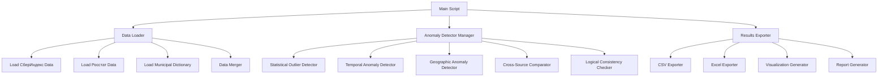

# Design Document: СберИндекс Anomaly Detection System

## Overview

Система анализа аномалий представляет собой Python-приложение для обнаружения статистических отклонений в данных СберИндекса и Росстата. Архитектура построена по модульному принципу с разделением на компоненты загрузки данных, детекторы аномалий, агрегатор результатов и экспортер.

### Key Design Decisions

1. **Модульная архитектура**: Каждый тип детектора аномалий реализован как отдельный класс для гибкости и расширяемости
2. **Pandas-центричный подход**: Использование pandas для всех операций с данными обеспечивает производительность и удобство
3. **Конфигурируемые пороги**: Все пороговые значения вынесены в конфигурационный файл для простой настройки
4. **Единый формат аномалий**: Все детекторы возвращают результаты в стандартизированном формате для упрощения агрегации
5. **Разовый анализ**: Система не требует базы данных или постоянного хранилища, все результаты сохраняются в файлы

## Architecture



### Data Flow

1. **Загрузка**: Все parquet файлы загружаются в pandas DataFrames
2. **Объединение**: Данные объединяются по territory_id с использованием справочника муниципалитетов
3. **Детекция**: Каждый детектор анализирует данные и возвращает список аномалий
4. **Агрегация**: Результаты всех детекторов объединяются и ранжируются
5. **Экспорт**: Финальные результаты сохраняются в CSV/Excel с визуализациями

## Components and Interfaces

### 1. Data Loader Module (`data_loader.py`)

**Responsibility**: Загрузка и предварительная обработка всех источников данных

**Classes**:

```python
class DataLoader:
    """Загружает и объединяет все источники данных"""
    
    def load_sberindex_data() -> Dict[str, pd.DataFrame]:
        """
        Загружает данные СберИндекса
        Returns: {
            'connection': DataFrame,
            'consumption': DataFrame,
            'market_access': DataFrame
        }
        """
    
    def load_rosstat_data() -> Dict[str, pd.DataFrame]:
        """
        Загружает данные Росстата
        Returns: {
            'population': DataFrame,
            'migration': DataFrame,
            'salary': DataFrame
        }
        """
    
    def load_municipal_dict() -> pd.DataFrame:
        """Загружает справочник муниципалитетов"""
    
    def merge_datasets(sberindex: Dict, rosstat: Dict, 
                      municipal: pd.DataFrame) -> pd.DataFrame:
        """
        Объединяет все датасеты по territory_id
        Returns: Unified DataFrame с колонками:
            - territory_id
            - municipal_district_name_short
            - region_name
            - consumption_* (по категориям)
            - market_access
            - population_total
            - migration_total
            - salary_avg
        """

    def validate_data(df: pd.DataFrame) -> Dict[str, Any]:
        """
        Проверяет качество данных
        Returns: {
            'missing_values': Dict[str, int],
            'duplicate_ids': List[int],
            'data_types': Dict[str, str]
        }
        """
```

**Key Design Patterns**:
- Factory pattern для создания загрузчиков разных типов файлов
- Strategy pattern для различных методов объединения данных

### 2. Anomaly Detector Manager (`anomaly_detector.py`)

**Responsibility**: Координация всех детекторов аномалий

**Base Class**:

```python
class BaseAnomalyDetector(ABC):
    """Базовый класс для всех детекторов"""
    
    @abstractmethod
    def detect(self, df: pd.DataFrame, config: Dict) -> pd.DataFrame:
        """
        Обнаруживает аномалии
        Returns: DataFrame с колонками:
            - territory_id
            - indicator
            - anomaly_type
            - actual_value
            - expected_value
            - deviation
            - severity_score (0-100)
            - description
        """
```

**Concrete Detectors**:

```python
class StatisticalOutlierDetector(BaseAnomalyDetector):
    """Обнаруживает статистические выбросы"""
    
    def detect_zscore_outliers(df: pd.DataFrame, threshold: float = 3.0)
    def detect_iqr_outliers(df: pd.DataFrame, multiplier: float = 1.5)
    def detect_percentile_outliers(df: pd.DataFrame, lower: float = 1, upper: float = 99)

class TemporalAnomalyDetector(BaseAnomalyDetector):
    """Обнаруживает временные аномалии"""
    
    def detect_sudden_spikes(df: pd.DataFrame, threshold: float = 100)
    def detect_trend_reversals(df: pd.DataFrame)
    def detect_high_volatility(df: pd.DataFrame, multiplier: float = 2.0)

class GeographicAnomalyDetector(BaseAnomalyDetector):
    """Обнаруживает географические аномалии"""
    
    def detect_regional_outliers(df: pd.DataFrame, threshold: float = 2.0)
    def detect_cluster_outliers(df: pd.DataFrame)
    def detect_urban_rural_anomalies(df: pd.DataFrame)

class CrossSourceComparator(BaseAnomalyDetector):
    """Сравнивает СберИндекс с Росстатом"""
    
    def calculate_correlations(sberindex: pd.DataFrame, rosstat: pd.DataFrame)
    def detect_large_discrepancies(threshold: float = 50)
    def rank_by_discrepancy(df: pd.DataFrame)

class LogicalConsistencyChecker(BaseAnomalyDetector):
    """Проверяет логическую согласованность"""
    
    def detect_negative_values(df: pd.DataFrame, columns: List[str])
    def detect_impossible_ratios(df: pd.DataFrame)
    def detect_contradictory_indicators(df: pd.DataFrame)
```

### 3. Results Aggregator (`results_aggregator.py`)

**Responsibility**: Объединение и ранжирование результатов всех детекторов

```python
class ResultsAggregator:
    """Агрегирует результаты всех детекторов"""
    
    def combine_anomalies(anomalies: List[pd.DataFrame]) -> pd.DataFrame:
        """Объединяет результаты всех детекторов"""
    
    def calculate_municipality_scores(df: pd.DataFrame) -> pd.DataFrame:
        """
        Рассчитывает общий score для каждого муниципалитета
        Returns: DataFrame с колонками:
            - territory_id
            - municipal_name
            - total_anomalies_count
            - total_severity_score
            - anomaly_types (список типов)
        """
    
    def rank_anomalies(df: pd.DataFrame) -> pd.DataFrame:
        """Ранжирует аномалии по severity_score"""
    
    def categorize_anomalies(df: pd.DataFrame) -> Dict[str, pd.DataFrame]:
        """
        Группирует аномалии по типам
        Returns: {
            'statistical_outliers': DataFrame,
            'temporal_anomalies': DataFrame,
            'geographic_anomalies': DataFrame,
            'data_quality_issues': DataFrame,
            'logical_inconsistencies': DataFrame
        }
        """
```

### 4. Results Exporter (`exporter.py`)

**Responsibility**: Экспорт результатов в различные форматы

```python
class ResultsExporter:
    """Экспортирует результаты анализа"""
    
    def export_master_csv(df: pd.DataFrame, output_dir: str):
        """Экспортирует полную таблицу аномалий в CSV"""
    
    def export_summary_excel(anomalies: Dict[str, pd.DataFrame], 
                            summary: pd.DataFrame, output_dir: str):
        """
        Создает Excel файл с несколькими листами:
        - Overview: общая статистика
        - Statistical_Outliers: статистические выбросы
        - Temporal_Anomalies: временные аномалии
        - Geographic_Anomalies: географические аномалии
        - Data_Quality_Issues: проблемы качества данных
        - Top_Municipalities: топ аномальных муниципалитетов
        - Data_Dictionary: описание колонок
        """
    
    def generate_visualizations(df: pd.DataFrame, output_dir: str):
        """
        Создает визуализации:
        - Распределение аномалий по типам (bar chart)
        - Топ-20 муниципалитетов по severity (horizontal bar)
        - Географическое распределение (heatmap по регионам)
        - Распределение severity scores (histogram)
        """
    
    def generate_report(df: pd.DataFrame, output_dir: str):
        """Создает текстовый отчет с ключевыми находками"""
```

## Data Models

### Unified Dataset Schema

После объединения всех источников создается единый датасет:

```python
unified_df = pd.DataFrame({
    'territory_id': int,
    'municipal_district_name_short': str,
    'region_name': str,
    'oktmo': str,
    
    # СберИндекс - Consumption (по категориям)
    'consumption_продовольствие': float,
    'consumption_здоровье': float,
    'consumption_транспорт': float,
    # ... другие категории
    
    # СберИндекс - Market Access
    'market_access': float,
    
    # Росстат - Population
    'population_total': float,
    'population_male': float,
    'population_female': float,
    
    # Росстат - Migration
    'migration_total': float,
    
    # Росстат - Salary
    'salary_avg': float,
    'salary_manufacturing': float,
    # ... другие отрасли
    
    # Metadata
    'data_completeness_score': float,  # 0-1
    'last_update_date': str
})
```

### Anomaly Record Schema

Каждая обнаруженная аномалия представлена записью:

```python
anomaly_record = {
    'anomaly_id': str,  # UUID
    'territory_id': int,
    'municipal_name': str,
    'region_name': str,
    'indicator': str,  # название показателя
    'anomaly_type': str,  # тип аномалии
    'actual_value': float,
    'expected_value': float,  # может быть None
    'deviation': float,  # абсолютное отклонение
    'deviation_pct': float,  # процентное отклонение
    'severity_score': float,  # 0-100
    'z_score': float,  # может быть None
    'data_source': str,  # 'sberindex' или 'rosstat'
    'detection_method': str,  # метод обнаружения
    'description': str,  # человекочитаемое описание
    'potential_explanation': str,  # возможное объяснение
    'detected_at': datetime
}
```

## Error Handling

### Error Handling Strategy

1. **Graceful Degradation**: Если один источник данных недоступен, система продолжает работу с доступными
2. **Logging**: Все ошибки логируются с уровнями ERROR, WARNING, INFO
3. **Validation**: Входные данные валидируются перед обработкой
4. **Exception Hierarchy**:

```python
class AnomalyDetectionError(Exception):
    """Базовое исключение"""

class DataLoadError(AnomalyDetectionError):
    """Ошибка загрузки данных"""

class DataValidationError(AnomalyDetectionError):
    """Ошибка валидации данных"""

class DetectionError(AnomalyDetectionError):
    """Ошибка в процессе детекции"""

class ExportError(AnomalyDetectionError):
    """Ошибка экспорта результатов"""
```

### Logging Configuration

```python
logging_config = {
    'version': 1,
    'handlers': {
        'file': {
            'class': 'logging.FileHandler',
            'filename': 'output/anomaly_detection.log',
            'level': 'INFO'
        },
        'console': {
            'class': 'logging.StreamHandler',
            'level': 'WARNING'
        }
    },
    'root': {
        'level': 'INFO',
        'handlers': ['file', 'console']
    }
}
```

## Testing Strategy

### Unit Testing

Каждый компонент тестируется независимо:

1. **Data Loader Tests**:
   - Тест загрузки каждого типа файла
   - Тест обработки отсутствующих файлов
   - Тест валидации схемы данных
   - Тест объединения датасетов

2. **Detector Tests**:
   - Тест каждого метода детекции на синтетических данных
   - Тест граничных случаев (пустые данные, все значения одинаковые)
   - Тест корректности расчета severity_score

3. **Aggregator Tests**:
   - Тест объединения результатов
   - Тест ранжирования
   - Тест категоризации

4. **Exporter Tests**:
   - Тест создания CSV файлов
   - Тест создания Excel с множественными листами
   - Тест генерации визуализаций

### Integration Testing

Тестирование полного pipeline:

1. **End-to-End Test**: Запуск всего процесса на тестовом датасете
2. **Output Validation**: Проверка корректности структуры выходных файлов
3. **Performance Test**: Проверка времени выполнения на полном датасете

### Test Data

Создание синтетических данных для тестирования:

```python
def create_test_data():
    """Создает тестовый датасет с известными аномалиями"""
    # Нормальные данные
    normal_data = np.random.normal(100, 10, 1000)
    
    # Добавляем известные аномалии
    outliers = [500, -50, 1000]  # статистические выбросы
    
    # Временные аномалии
    spike_data = [100, 100, 500, 100, 100]  # резкий скачок
    
    return test_df
```

## Configuration

### Configuration File (`config.yaml`)

```yaml
# Пороги для детекции аномалий
thresholds:
  statistical:
    z_score: 3.0
    iqr_multiplier: 1.5
    percentile_lower: 1
    percentile_upper: 99
  
  temporal:
    spike_threshold: 100  # процент изменения
    drop_threshold: -50
    volatility_multiplier: 2.0
  
  geographic:
    regional_z_score: 2.0
    cluster_threshold: 2.5
  
  cross_source:
    correlation_threshold: 0.5
    discrepancy_threshold: 50  # процент
  
  logical:
    check_negative_values: true
    check_impossible_ratios: true

# Настройки экспорта
export:
  output_dir: "output"
  timestamp_format: "%Y%m%d_%H%M%S"
  top_n_municipalities: 50
  
# Настройки визуализации
visualization:
  figure_size: [12, 8]
  dpi: 300
  style: "seaborn-v0_8"
  
# Настройки логирования
logging:
  level: "INFO"
  format: "%(asctime)s - %(name)s - %(levelname)s - %(message)s"
```

## Performance Considerations

### Optimization Strategies

1. **Vectorized Operations**: Использование pandas vectorized operations вместо циклов
2. **Chunking**: Обработка больших датасетов по частям если необходимо
3. **Caching**: Кэширование промежуточных результатов для повторного использования
4. **Parallel Processing**: Использование multiprocessing для независимых детекторов

### Expected Performance

- **Data Loading**: ~5-10 секунд для всех файлов
- **Detection**: ~30-60 секунд для всех детекторов
- **Export**: ~10-15 секунд для всех форматов
- **Total Runtime**: ~1-2 минуты для полного анализа

### Memory Management

- Использование категориальных типов для строковых колонок
- Освобождение памяти после обработки каждого детектора
- Оценка памяти: ~500MB-1GB для полного датасета

## Dependencies

### Core Dependencies

```
pandas>=2.0.0
numpy>=1.24.0
pyarrow>=14.0.0
openpyxl>=3.1.0
matplotlib>=3.7.0
seaborn>=0.12.0
scipy>=1.10.0
pyyaml>=6.0
```

### Development Dependencies

```
pytest>=7.4.0
pytest-cov>=4.1.0
black>=23.0.0
flake8>=6.0.0
mypy>=1.4.0
```

## Deployment

### Project Structure

```
sberindex-anomaly-detection/
├── src/
│   ├── __init__.py
│   ├── data_loader.py
│   ├── anomaly_detector.py
│   ├── results_aggregator.py
│   ├── exporter.py
│   └── utils.py
├── tests/
│   ├── test_data_loader.py
│   ├── test_detectors.py
│   ├── test_aggregator.py
│   └── test_exporter.py
├── output/
│   └── .gitkeep
├── config.yaml
├── main.py
├── requirements.txt
└── README.md
```

### Execution

```bash
# Установка зависимостей
pip install -r requirements.txt

# Запуск анализа
python main.py

# Результаты будут в папке output/
```

## Future Enhancements

Возможные улучшения для будущих версий:

1. **Machine Learning**: Использование ML моделей для предсказания аномалий
2. **Interactive Dashboard**: Web-интерфейс для интерактивного исследования аномалий
3. **Automated Explanations**: Автоматическая генерация объяснений для аномалий
4. **Real-time Monitoring**: Система мониторинга для обнаружения аномалий в реальном времени
5. **API Integration**: REST API для интеграции с другими системами
